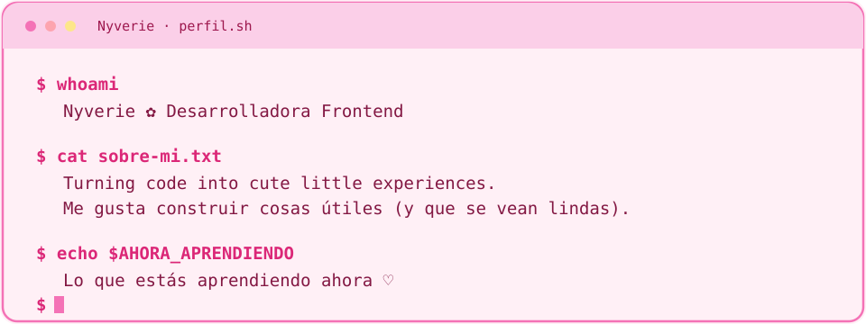

 

 

---

## ✿ sobre mí

  

---

## ✿ mi stack

<table>
  <tr>
    <td width="50%" valign="top" align="center">
      <b>♡ Lenguajes</b>  
       
      JavaScript · TypeScript · Python · Java · HTML · CSS
    </td>
    <td width="50%" valign="top" align="center">
      <b>♡ Frameworks y librerías</b>  
       
      React · Next.js · Node.js · Express · Tailwind
    </td>
  </tr>
  <tr>
    <td valign="top" align="center">
      <b>♡ Bases de datos</b>  
       
      MySQL · PostgreSQL · MongoDB
    </td>
    <td valign="top" align="center">
      <b>♡ Herramientas</b>  
       
      Git · GitHub · Docker · Linux · VS Code · Figma
    </td>
  </tr>
</table>

---

## ✿ mis números

 

---

## ✿ hablemos

  

Hecho con 💖 y mucho sueño · @TU_USUARIO

